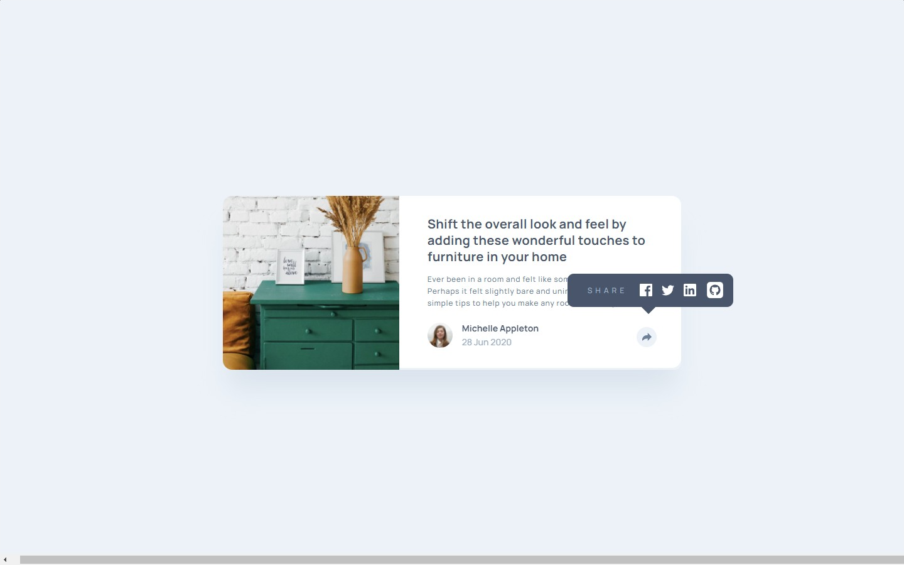
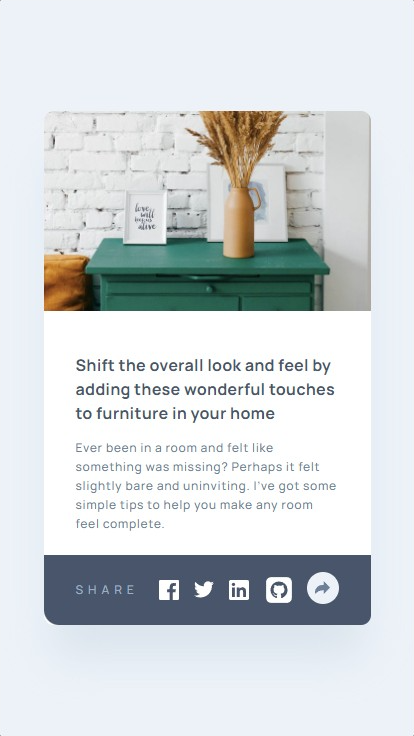

# Frontend Mentor - Article-preview-component

Esta é uma solução para o [article-preview-component](https://www.frontendmentor.io/challenges/article-preview-component-dYBN_pYFT). Os desafios do Frontend Mentor ajudam você a melhorar suas habilidades de codificação ao construir projetos realistas.

## Resumo de conteúdos

- [Visão Geral](#Visão-Geral)
  - [O desafio](#O-desafio)
  - [Captura de tela](#Captura-de-tela)
  - [Links](#Links)
- [Meu processo](#Meu-processo)
  - [Construído com](#Constrído-com)
  - [O que eu aprendi](#O-que-eu-aprendi)
  - [Continuação dos desenvolvimentos](#Continuação-dos-desenvolvimentos)
  - [Recursos utilizados](#Recursos-utilizados)
- [Autor](#Autor)

## Visão Geral.

### O desafio

Os usuários devem ser capazes de:

- Visualizar estados de foco para elementos interativos.
- Criação de um cartão de informações.
- Observar um design responsivo.
- Visualizar os links de compartilhamento de mídia social ao clicar no ícone de compartilhamento

### Captura de tela

- Desktop
<p  align="center" >
  
</p>

- Desktop ativo
<p  align="center" >
  
</p>


- Tablet
<p  align="center" >

</p>

- Mobile
<p  align="center" >

</p>

- Mobile ativo
<p  align="center" >

</p>

- Gif
<p  align="center" >

</p>

### Links

- Solução URL: [https://github.com/michelwene/intro-component-with-signup-form](https://github.com/michelwene/intro-component-with-signup-form)
- Site URL: [https://michelwene.github.io/intro-component-with-signup-form/](https://michelwene.github.io/intro-component-with-signup-form/)

## Meu processo

### Construído com

- HTML5
- CSS3
- Flexbox
- Grid
- Design responsivo
- EMMET
- JavaScript

### O que eu aprendi

```html
<h1>Algum código HTML de que me orgulho</h1>
<div class="compartilhar">
            <p>share</p>
            <ul>
              <li>
                <a href="#">
                  
                </a>
              </li>
              <li>
                <a href="#">
                  
                </a>
              </li>
              <li>
                <a href="https://www.linkedin.com/in/michelwene/"
                  ></a>
              </li>
              <li>
                <a href="https://github.com/michelwene"></a>
              </li>
            </ul>
          </div>

<!-- Este HTML foi que utilizei para construir o card de "share" onde estruturei ele no HTML porém desabilitei ele no CSS, habilitando-o apenas quando clico no botaão de compartilhamento atraves de uma função no JS-->
```
```css
.compartilhar {
  align-items: center;
  background: var(--var-Azul-acizentado-escuro);
  border-bottom-right-radius: 1.5rem;
  border-bottom-left-radius: 1.5rem;
  bottom: 0;
  display: flex;
  left: 0;
  opacity: 0; /* opacidade zero para fica tudo transparente*/
  padding: 0 3.2rem;
  position: absolute;
  top: 0;
  transition: all 0.5s ease-in-out;
  visibility: hidden;/*visibility hidden para não mostrar nada que estiver nesta classe*/
  width: 100%;
}

.show {
  opacity: 1;
  visibility: visible;
  /*após realizar o click na imagem de compartilhamento, esta classe é inserida na div da classe "compartilhar", onde pode se observar que ela coloca "visibility: visible e opacity: 1", esta funcionalidade só foi possível atravez da função no JS*/
}

/*Esta duas classe eu diria resumidamente que proporcionou a amostragem do campo de compartilhamento ao clicar no botão "compartilhar".*/
```

```javaScript
const arrow = document.querySelector(".seta");
const show = document.querySelector(".compartilhar");

arrow.addEventListener("click", function () {
  show.classList.toggle("show");
});

/*Basicamente esta é a função que utilizei para inserir um classe na div "compartilhar" onde inicialmente esta div esta com visibily: hidden e quando eu clico na seta ele coloca esta classe "show", onde no CSS ela esta com "visibily: visible" e "opacity: 1", ou seja, ela mostra para mim o card de compartilhamento.
E para selecionar o clique, eu adicionei um evento de "click" no ícone da seta no HTML e quando clicado ela chama a função acima.
```

### Continuação dos desenvolvimentos

Pretendo continuar fazendo projetos do FrontendMentor, para melhorar meu HTML, CSS, JavaScript.

### Recursos utilizados

- [Stackoverflow](https://stackoverflow.com/) - Este site me ajudou muito na realização das funções do javascript.
- [Developer mozilla](https://developer.mozilla.org/pt-BR/docs/Web/API/Document/querySelector) - Este site me auxiliou na questão do querySelector, onde puder compreender como o mesmo funciona e montar minha função.

## Autor

- Frontend Mentor - [@michelwene](https://www.frontendmentor.io/profile/michelwene)
- Linkedin - [@michelwene](https://www.linkedin.com/in/michelwene/)
